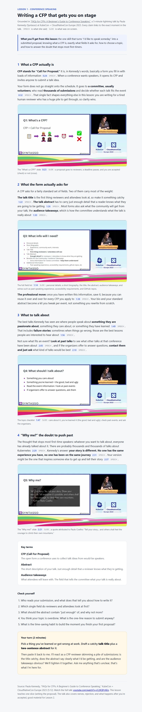

# Example: a real lesson built by yt-tutor

This is an actual lesson the skill produced, not a mockup. The agent ingested a 5-minute
conference talk ([“FAQs for CFPs: A Beginner’s Guide to Conference Speaking”](https://www.youtube.com/watch?v=jCz9QPrJ6Eo),
Paula Kennedy, KubeCon + CloudNativeCon Europe 2023), then taught one slice of it as a single
self-contained lesson.

**Open it:** [`cfp-lesson/lesson.html`](cfp-lesson/lesson.html) (download and open in a browser).



## What makes it a fair proof, not a claim

- **Grounded in the video.** Every point links to a clickable `mm:ss` moment in the source talk,
  and each is labeled *speech* or *visual*. The agent invented nothing.
- **Real on-screen frames, embedded.** The four slides (Q1, Q3, Q4, Q5) are the actual keyframes
  the agent extracted and read, not stock images or descriptions. It recorded what it saw with
  `set-vision`, so a slide’s own words (for example *accessibility requirements, github repos*)
  also became searchable.
- **Verified before it was kept.** The lesson was checked with `yt-tutor verify --lesson lesson.html`,
  a one-pass pass over every cited timestamp against the transcript and the frames. That check
  caught a real citation drift in the draft (“accepted before” where the speaker actually said
  “what other talks have been about”), which was corrected.
- **Dense, with a feedback loop.** Four cited sections, a key-terms box, check questions, and a
  practice task, not a one-paragraph stub.

## How it was made

```bash
yt-tutor ingest "https://www.youtube.com/watch?v=jCz9QPrJ6Eo" --no-vision
yt-tutor digest jCz9QPrJ6Eo --md          # the agent reads this to know the talk
# the agent reads the slides it needs, records them, folds them into the store:
yt-tutor keyframes jCz9QPrJ6Eo --pending --by-salience
yt-tutor set-vision jCz9QPrJ6Eo --at 74 --file q3.json
yt-tutor rechunk jCz9QPrJ6Eo
# ... the agent writes lesson.html, then:
yt-tutor verify jCz9QPrJ6Eo --lesson lesson.html   # the trust gate
```

See [`docs/DEMO.md`](../DEMO.md) for the full command walkthrough and [`SKILL.md`](../../SKILL.md)
for the teaching procedure the agent follows.
